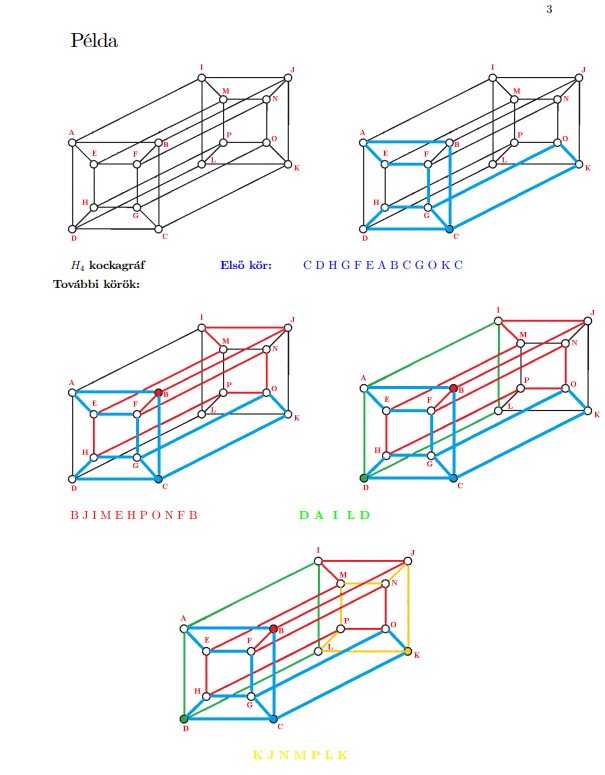
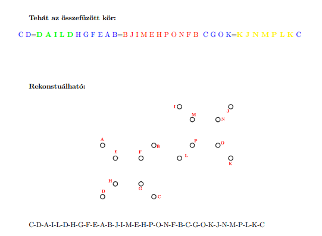
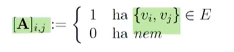
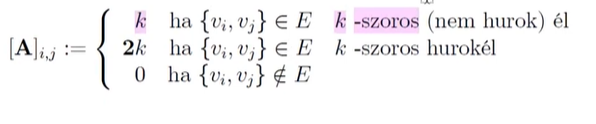
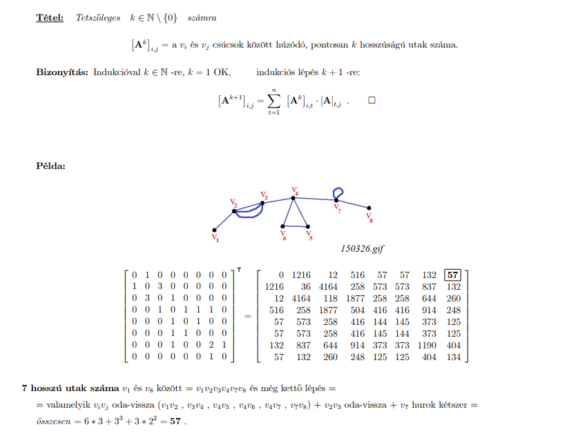
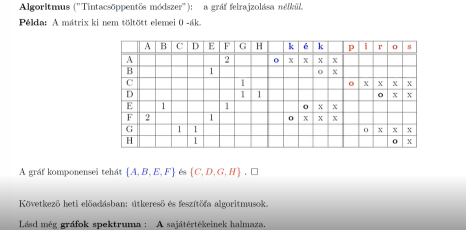
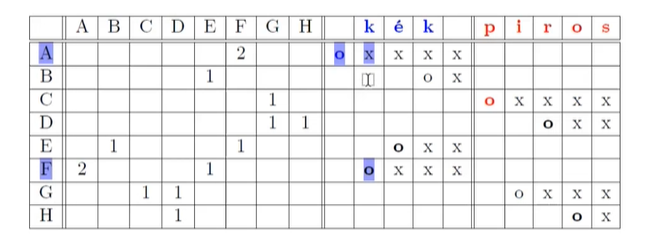
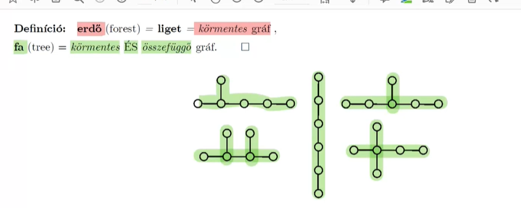
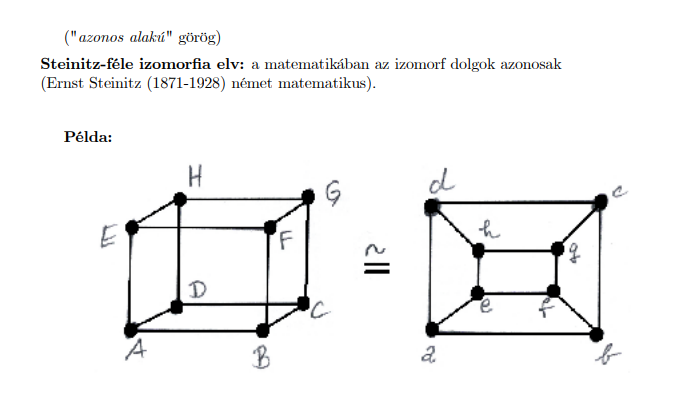
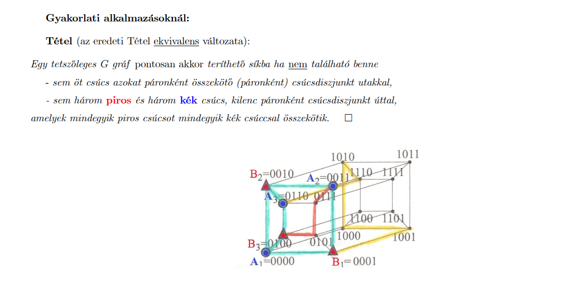

# Gráfelmélet Alapjai

## Mi a gráf?
 - A gráf nem csupán "pontok és vonalak" halmaza, hanem egy matematikai struktúra.
 - $G = (V, E)$: A gráfot a csúcsok ($V$) és az élek ($E$) halmaza alkotja.
 - Csúcsok ($V$ - Vertex): Egy tetszőleges, nem üres halmaz.
 - Élek ($E$ - Edges): A csúcsok közötti bináris reláció.
 

## 2. Definíciók

* **Gráf:** Egy gráf egy rendezett pár: $G = (V, E)$.
* **V (Vertices):** A csúcsok halmaza. Egy csúcsot gyakran betűvel (pl. $v$, $w$) vagy számmal jelölünk.
* **E (Edges):** Az élek halmaza. Egy él két csúcsot köt össze. Egy élet gyakran csúcspárokkal jelölünk, pl. $\{u, v\}$, ahol $u$ és $v$ a csúcsok.
* **Irányított Gráf:** Egy gráf, ahol az éleknek iránya van. Egy irányított él egy rendezett pár, pl. $(u, v)$, ami egy $u$-ból $v$-be mutató élet jelöl.
* **Irányítatlan Gráf:** Egy gráf, ahol az éleknek nincs iránya. Egy irányítatlan él egy rendezetlen pár, pl. $\{u, v\}$, ami egy $u$ és $v$ közötti kapcsolatot jelöl.
* **Súlyozott Gráf:** Egy gráf, ahol minden élhez tartozik egy súly. Egy él súlyát gyakran számmal jelöljük, pl. $w(u, v)$, ami az $u$ és $v$ közötti él súlya.
* **Teljes Gráf:** Egy olyan gráf, ahol minden csúcspár között van él. Egy $n$ csúcsú teljes gráfot $K_n$-nel jelölünk.

## 3. Gráftípusok

* **Egyszerű Gráf:** Olyan gráf, aminek nincs többszörös éle és hurokéle.
* **Hurokél:** Olyan él, aminek a két végpontja ugyanaz a csúcs.
* **Többszörös Élek:** Olyan élek, amik ugyanazt a csúcspárt kötik össze.
* **Hipergráf:** Olyan halmazrendszer, ahol az élek tetszőleges számú csúcsot tartalmazhatnak: $E \subseteq \mathcal{P}(V)$.
* **Fa:** Olyan összefüggő gráf, aminek nincs köre.
* **Erdő:** Olyan gráf, aminek minden összefüggő komponense fa.

### 3.1. Nevezetes Gráfok
#### Teljes gráf ($K_n$)
Mindenki össze van kötve mindenkivel. 
* Élek száma: $\binom{n}{2}$ 

#### Páros gráf (Bipartite)
A csúcsokat két csoportra ($A$ és $B$) tudjuk osztani úgy, hogy:
* Egy csoporton belül **nincs** él.
* Élek csak $A$ és $B$ elemei között futhatnak.
* **Teljes páros gráf ($K_{m,n}$):** Ha az $A$ csoport minden tagja össze van kötve a $B$ csoport összes tagjával.

## Részgráfok (Gráf a gráfban)

Ha egy gráfból kiválasztunk bizonyos csúcsokat és éleket, **részgráfot** kapunk[cite: 100]. Legyen az eredeti gráf $G = (V, E)$, a részgráf pedig $H = (W, F)$[cite: 101].

### Típusok:

* **Sima részgráf ($H \le G$):** * Akkor beszélünk róla, ha a részgráf csúcsai az eredeti csúcsok halmazának részhalmaza ($W \subseteq V$) és az élei is az eredeti élek részhalmaza ($F \subseteq E$).
    * **Lényege:** Csak bizonyos csúcsokat és bizonyos éleket tartunk meg[cite: 136].

* **Feszítő részgráf (Spanning subgraph):** * Olyan részgráf, ahol a csúcshalmaz megegyezik az eredeti gráféval ($W = V$).
    * **Lényege:** Az **összes eredeti csúcsot** megtartjuk, de csak néhány élt választunk ki melléjük.

* **Feszített részgráf (Spanned / Induced subgraph) ($H \prec G$):** * Akkor feszített, ha $W \subseteq V$ és az élek halmaza pontosan a kiválasztott csúcsok között az eredeti gráfban futó összes élet tartalmazza ($F = [W]^2 \cap E$)[cite: 112, 117].
    * **Lényege:** Kiválasztunk néhány csúcsot, és **minden olyan élet** meg kell tartanunk, ami az eredeti gráfban ezen csúcsok között futott.

## 4. Fokszám és Összefüggőség

* **Fokszám:** Egy $v$ csúcs fokszáma, $d(v)$, az a csúcsba befutó élek száma. Irányított gráf esetén bemenő és kimenő fokszámról beszélünk, $d_{in}(v)$ és $d_{out}(v)$, ami a csúcsba befutó és a csúcsból kiinduló élek száma.
* **Izolált Csúcs:** Egy olyan csúcs, aminek a fokszáma 0.
* **Összefüggő Gráf:** Olyan gráf, aminek minden csúcspárja között van út.

## 4. Fokszám és Összefüggőség

* **Fokszám:** Azt mutatja meg, hogy egy adott csúcsba hány él fut be.
* **Irányított gráf esetén:** Megkülönböztetünk "befutó" (mennyi jön be) és "kiinduló" (mennyi megy ki) éleket.
* **Izolált csúcs:** Olyan magányos pont, aminek egyetlen szomszédja sincs, tehát a fokszáma 0.
* **Összefüggő gráf:** Olyan hálózat, ahol nincsenek elszigetelt szigetek; bármelyik pontból el lehet jutni bármelyik másikba az éleken lépkedve.

## 5. Utak és Körök

* **Út (Pk):** Pontok olyan sorozata, ahol minden pont össze van kötve a következővel (mint egy útvonal a térképen).
* **Szabály:** Egy 3 lépéses úthoz 4 pontot érintünk (mindig eggyel több a csúcs, mint az él).
* **Kör (Ck):** Olyan út, ami végül visszakanyarodik a saját kiindulópontjába.
* **Szabály:** Itt a pontok és az élek száma pontosan megegyezik.
* **Egyszerű út / egyszerű kör:** Olyan bejárás, ahol semelyik útszakaszt és semelyik várost (pontot) nem érinted kétszer.

## 6. Összefüggőség és Komponensek

* **Komponens:** A gráf különálló "szigetei". Egy szigeten belül mindenki elér mindenkit, de a szigetek között nincs átjárás.
* **Összefüggő gráf:** Akkor mondjuk, ha a gráf egyetlen hatalmas szigetből áll, nincsenek különálló részei.

## 7. Fokszámok és a "Kézfogás" szabály

* **Fokszám (δ(v)):** Megmutatja, hány éldarab csatlakozik egy ponthoz.
* **Hurokél:** Mivel a pontból indul és oda is érkezik vissza, a számolásnál **2-nek számít**.
* **Többszörös élek:** Minden egyes vonalat külön bele kell számolni a fokszámba.
* **Kézfogási tétel:** Ha összeadjuk az összes pont fokszámát, pontosan az élek számának a dupláját kapjuk (mivel minden élet két végénél fogva számolunk meg).
* **Következmény:** Egyetlen gráfban sem lehet páratlan számú olyan pont, aminek páratlan a fokszáma (mindig párban kell lenniük).

## 8. Egyéb fogalmak

* **Komplementer gráf:** A gráf "fordítottja". Ami az eredetiben össze volt kötve, itt nem lesz, és minden olyan kapcsolatot behúzunk, ami eddig hiányzott.
* **Izomorfia:** Két gráf "szerkezeti ikerpárja". Lehet, hogy máshogy rajzoltuk le őket, de a pontok száma és a kapcsolataik rendszere pontosan ugyanaz. Ilyen például a Petersen- és a Kempe-gráf.matikai tulajdonságaik ugyanazok (például a Petersen-gráf és a Kempe-gráf).

# Euler-körök és Euler-utak

## Definíciók
* **Euler-út:** Olyan bejárás, amely a gráf minden **élén** pontosan egyszer halad át.
* **Euler-kör:** Olyan Euler-út, amely zárt (a kezdő- és végpont megegyezik).

## Tételek (Euler, 1736)

### 1. Tétel: Euler-kör létezése
Egy összefüggő gráfban akkor és csak akkor van **Euler-kör**, ha minden csúcs fokszáma **páros**.
> *Magyarázat:* Minden csúcshoz tartozó belépő élhez kell egy kilépő él is.

### 2. Tétel: Euler-út létezése
Egy összefüggő gráfban akkor és csak akkor van **Euler-út**, ha a páratlan fokszámú csúcsok száma **0 vagy 2**.
* Ha 0: a gráfban Euler-kör van.
* Ha 2: az út az egyik páratlan fokszámú csúcsból indul és a másikban végződik.

---

## Hierholzer-algoritmus (Körök összefűzése)
Ha a gráf minden fokszáma páros, az Euler-kör módszeresen felépíthető:
1. Induljunk egy tetszőleges $v_0$ csúcsból.
2. Haladjunk addig, amíg vissza nem érünk $v_0$-ba (ez egy rész-kör: $C_0$).
3. Ha maradtak bejáratlan élek, válasszunk egy olyan csúcsot a már bejárt úton, aminek van még "szabad" éle.
4. Indítsunk onnan egy újabb kört, majd "szúrjuk be" az eredeti útba.

### Példa (H4 kockagráf bejárása)
A jegyzetben látható színes felbontás:
- **Kék kör:** `C-D-H-G-F-E-A-B-C-G-O-K-C`
- **Piros kör:** `B-J-I-M-E-H-P-O-N-F-B`
- **Zöld kör:** `D-A-I-L-D`
- **Sárga kör:** `K-J-N-M-P-L-K`

**Összefűzött teljes Euler-kör:**
`C-D-A-I-L-D-H-G-F-E-A-B-J-I-M-E-H-P-O-N-F-B-C-G-O-K-J-N-M-P-L-K-C`

---

# Hamilton-körök és utak

## Definíciók
* **Hamilton-út:** Olyan út, amely a gráf **minden csúcsán** pontosan egyszer halad át.
* **Hamilton-kör:** Olyan Hamilton-út, amely zárt (visszaér a kezdőpontba).
* **Különbség:** Itt a csúcsok a fontosak, nem az élek! (Nem kell minden élet érinteni).

## Az NP-teljesség
A Hamilton-kör keresése egy **NP-teljes** probléma. Nincs rá olyan gyors algoritmus, mint az Euler-körre. Nagy csúcsszám esetén a megoldás csak próbálgatással (permutációkkal) kereshető meg, ami lassú.

---

## Negatív feltételek (Kizáró okok)

### 1. Hamilton-körhöz:
Ha létezik $k$ darab pont, aminek elhagyásával a gráf több mint $k$ komponensre esik szét $\rightarrow$ **Nincs Hamilton-kör**.

### 2. Hamilton-úthoz:
Ha létezik $k$ darab pont, aminek elhagyásával a gráf több mint $k+1$ komponensre esik szét $\rightarrow$ **Nincs Hamilton-út**.

---

## Pozitív tételek (Elegendő feltételek)

Ha egy egyszerű gráfban ($n \geq 3$ csúcs) teljesül valamelyik alábbi, akkor **biztosan van** benne Hamilton-kör:

1.  **Dirac-tétel (1952):** Minden csúcs fokszáma legalább $n/2$.
    $$\delta(v) \geq \frac{n}{2}$$
2.  **Ore-tétel (1960):** Bármely két nem szomszédos csúcs ($u, v$) fokszámösszege legalább $n$.
    $$d(u) + d(v) \geq n$$

3.  **Pósa Lajos tétele (Hamilton-kör)**
Nem csak a minimum fokszámot nézi, hanem a "gyenge" pontok arányát.
* **Feltétel:** Minden $1 \le k < n/2$ esetén a legfeljebb $k$ fokszámú csúcsok száma $< k$.
* **Üzenet:** Lehetnek kis fokszámú csúcsok, de nem lehet belőlük "túl sok", mert akkor elvágják a kört.

 **Erdős Pál tétele (Hamilton-út)**
Hasonló a Pósa-tételhez, de gyengébb feltétellel (mivel az utat könnyebb találni, mint a kört).
* **Feltétel:** Minden $1 \le k \le (n-1)/2$ esetén a legfeljebb $k$ fokszámú csúcsok száma $\le k$.
* **Üzenet:** Ez a tétel garantálja, hogy létezik egy útvonal, ami minden várost érint, még ha a végén nem is jutunk vissza a startba.

# Gráfok mátrixai és útvonalak összefoglaló

## 1. Adjacencia (Szomszédsági) mátrix - $A$
Egy $n \times n$-es mátrix, ahol a sorok és oszlopok a csúcsokat jelölik.

**1. definició G egyszerű gráf:**

Akkor beszélünk erről ha nincs hurokél, csak csúcsok, és élek vannak közöttük. Vagy van 0, vagy 1, tehát vagy van a csúcsok közt kapcsolat élel, vagy nincs. 

{Vi,Vj} i-edik sor, j-edik oszlop. 

**2. Definició G tetszőleges gráf:**

- Az első rózssaszin K érték azt mutatja meg hányszoros élekről beszélünk. Ha itt egy pl: 3-as szám van azt jelenti, hohgy a csúcsok között 3 élkapcsolat van. 
- Hurok élnél 2x kell írni, mert a fokszámot is 2x-esen növeli a hurokél.  
- A k lehet 0 is akkor nincs köztük kapcsolat.

 **A** szimmetrikus a főátlóra  -> $A^T$ = A ami azt jelenti, hogy a mátrix sor oszlopai felcserélhetőek, úgyanazt kapjuk. A transzponált = A.    
Ez mindkettőre igaz. 

**Mátrix nyoma:(Spur/Trace)= A főátlóban lévő elemek összeg:** 

Az összes elemek száma a mátrixban az élek száma X 2. 

### Kitöltési szabályok (Egyszerű és tetszőleges gráf):
* **Élek:** Ha $v_i$ és $v_j$ között van kapcsolat, akkor $[A]_{i,j} = 1$. Ha nincs, akkor $0$.
* **Többszörös élek:** Ha $k$ darab párhuzamos él van két pont között, a mátrixba **$k$** kerül.
* **Hurokél:** Ha egy pont önmagába tér vissza, a főátlóra **$2k$** kerül (minden hurok kettőt ér!).

### Alaptulajdonságok a mátrixból:
* **Fokszám:** Adott sor (vagy oszlop) elemeinek összege = az adott csúcs fokszáma.
* **Élek száma:** Az összes elem összege / 2.
* **Nyom (Spur):** A főátló elemeinek összege = $2 \times$ hurokélek száma.

---

## 2. Útvonalak számlálása ($A^k$)
A mátrix $k$-adik hatványa megmondja, hányféleképpen juthatunk el $i$-ből $j$-be **pontosan $k$ lépésben**.

* **Miért nőnek meg a számok?** A párhuzamos élek ($3^x$), a hurokélek és az oda-vissza lépkedés miatt a lehetőségek száma hatványozottan emelkedik.
* **Háromszögek száma:** Kiszámolható a harmadik hatványból: $Sp(A^3) / 6$.
* **Párosság (Bipartit):** Ha a gráfban nincs páratlan hosszú kör (3, 5, 7 lépéses visszatérés), akkor a gráf páros. Ilyenkor a mátrix átrendezhető úgy, hogy a főátló mentén csak nullák (blokk-nullák) legyenek.

---

Bal oldalt látható a csúcsmátrix. Bizonyítás nem kell azt hagytuk az órán. A gráfról leírható a csúcsmátrix. K=7-et választott a tanár úr, ami azt jelenti, a mátrixot megszorozta önmagával, majd azt újra önmagával stb 7x. Ebből lett a jobb oldali mátrix eredménye. Az indukciós tétel szerint ezt tömérdek információt tartalmaz. 

Mit jelent az elős sor utolsó eleme ami **57** ? 
 - Mivel a K=7 így azt jelenti, hogy a V1-ből a V8-ba 7 útal 57x tudok elmenni. 
 -  Tehát a K=7 az útak hosszát jelenti. 
  
Ezek tűrhető, tehát gyors algoritmus.

## 3. Összefüggőség és Szigetek

### Összefüggő vagy sem?
* **Összefüggő:** Ha az $Y = A + A^2 + \dots + A^{n-1}$ mátrixban **nincs nulla**, akkor bárhonnan bárhová el lehet jutni.
* **Nem összefüggő:** Ha a mátrix különálló blokkokra (szigetekre) esik szét, és a blokkok között csak nullák vannak.

### Tintacsöppentő módszer (Algoritmus)
Ez a módszer segít megtalálni a különálló komponenseket (szigeteket) rajzolás nélkül:

1. **Cseppentés:** Válassz egy tetszőleges csúcsot (sort), pl. **"A"**. Jelöld meg!
2. **Szétfolyás:** Nézd meg az **A** sorában, mely oszlopokban van szám (kik a szomszédai). Jelöld meg azokat is!
3. **Terjedés:** Menj az újonnan megjelölt csúcsok soraihoz, és nézd meg az ő szomszédaikat is. 
4. **Stop:** Ha már nem tudsz új csúcsot megjelölni, az összes megjelölt pont alkot **egy szigetet**.
5. **Újrakezdés:** Aki fehér maradt (nincs megjelölve), az egy másik szigeten van. Kezdd náluk újra a folyamatot!

A-ba belecsöppenti a tintát, belefolyik F-be. A kék, és a piros azok segédtáblázatok. Az A-ba azért ír a karika után X-et, mert onnan már kifolyt, ott már száradhat a **"tinta"**. Belefolyt az **F-be** oda mehet a karika. A segéd táblázatba ott kezdpdik ahol karika van oda befolyt. A többi x, és od amegy tovább, ahol van a következő karika, így a segédtáblázat alapján megtaláljuk a gráfokat(Kvázi merre folyik a tinta).

És ha megnézem honna indul (A sor). Érték van F-be(2) oda belefolyik. Ezután sortváltunk, megyünk az F-re. Abban a sorban vizsgáljuk meg, melyik oszlopba van érték. F sornál van A-ba, és E-be, tehát E-be tud a tinta tovább menni. Ugrunk E sorba, majd vizsgáljuk E sor melyik oszlopába van érték. E sorba B-nél, és F-nél van érték, tehát B-be is tovább folyik a tinta. Ugrunk B sorába, és ott csak E van amit már csekkoltunk, tehát a tinta, már semmere se tud tovább folyni. 

És mivel nem tud tovább folyni, ezért látható, hogy a gráf szétesik, és 2 különálló gráf lesz belőle. 2 diszkjunkt rész halmazra esik szét. Az eredeti gráf nem összefüggő, mert 2 külön részgráfra esik szét 

---

## 4. Bipartit (Páros) gráfok - Gyakori tévhitek
* **Tévhit:** Csak páros számú csúcs lehet benne. 
* **Valóság:** Lehet páratlan is (pl. 3 fiú, 2 lány). A lényeg, hogy **két csoportra** tudd bontani őket.
* **Szabály:** Csoporton belül (fiú-fiú vagy lány-lány) **tilos a kapcsolat**. Élek csak a két csoport között futhatnak.
* **Mátrix kép:** Ezért lesznek blokk-nullák a főátlón (nincs belső kapcsolat).

---
# Fák

* **Erdő (Forest) / Liget:** Olyan gráf, amiben **nincs kör**. (Vagyis nem tudsz úgy elindulni egy pontból, hogy egy útvonalon keresztül, élek ismétlése nélkül visszajuss ugyanoda).
* **Fa (Tree):** Olyan erdő, ami **összefüggő** is. (Vagyis nincsenek benne elszigetelt szigetek, minden pontból eljuthatsz minden pontba).

Az erdő komponensei ( zöldek) körmentesek és összefüggöek, tehát fák. 

A dia pontjai alapján a fák az alábbi tulajdonságokkal rendelkeznek:

1.  **Erdő részei:** Az erdő minden egyes különálló darabja (komponense) önmagában egy fa.
2.  **Egyszerűség:** A fákban és erdőkben **nincs hurokél és nincs többszörös él** (mert azok azonnal kört alkotnának).
3.  **Utak száma:**
    * **Összefüggő:** Bármely két pont között van **legalább egy** út.
    * **Körmentes:** Bármely két pont között van **legfeljebb egy** út.
    * **FA:** Bármely két pont között **PONTOSAN EGY** út van. (Ez a legfontosabb definíció!)
4.  **Kényes egyensúly:**
    * **Minimálisan összefüggő:** Ha egyetlen élt is kitörlünk a fából, az azonnal szétesik két darabra (megszűnik az összefüggőség).
    * **Maximálisan körmentes:** Ha bármely két nem szomszédos pont közé behúzunk egy új élt, azonnal létrejön egy kör.

# Gráfelmélet: Fokszámok és az élek száma (Összefoglaló)

## 1. Állítások: Mire következtethetünk a szerkezetből?

* **i) Ha mindenki ismer legalább 2 embert:** Ha minden csúcs fokszáma legalább 2 ($\delta(x) \geq 2$), akkor a gráfban **biztosan van kör**. (Gondoljunk bele: ha nem akarunk zsákutcát, előbb-utóbb visszaérünk valahova).
* **ii) Ha nincs kör (erdő):** Akkor az élek száma sosem érheti el a csúcsok számát: $|E| \leq |V| - 1$.
* **iii) Ha összefüggő:** Akkor kell legalább annyi él, hogy mindenkit összekössön: $|E| \geq |V| - 1$.
* **iv) Ha FA:** Akkor a kettő találkozik, és az élek száma **pontosan** eggyel kevesebb, mint a csúcsoké: **$|E| = |V| - 1$**.

De egyik sem fordítható meg. 

---

## 2. A "Bűvös Hármas" Tétel

Ez a dia legfontosabb része. Van 3 tulajdonság, amiből **bármelyik kettő automatikusan bizonyítja a harmadikat** (és ezzel azt, hogy a gráf egy **FA**):

* **a)** A gráf összefüggő.
* **b)** A gráf körmentes.
* **c)** Az élek száma eggyel kevesebb, mint a csúcsoké ($|E| = |V| - 1$).

### Példák a párosításra:
1. **Összefüggő + Körmentes** $\implies$ $|E| = |V| - 1$ (Ez a fa alapdefiníciója).
2. **Körmentes + $|E| = |V| - 1$** $\implies$ Összefüggő (Tehát fa).
3. **Összefüggő + $|E| = |V| - 1$** $\implies$ Körmentes (Tehát fa).

---

## 3. Fontos figyelmeztetés (v. pont)
**Egyik állítás sem fordítható meg magában!** *Példa:* Ha egy gráfban $|E| = |V| - 1$, az még **nem biztos**, hogy fa! Lehet, hogy van benne egy kör, és egy tőle teljesen elszigetelt pont ( a háromszög + egy különálló pont esete). Ahhoz, hogy fa legyen, a fenti hármasból legalább **kettőnek** egyszerre kell teljesülnie.

---

# Gráfok izomorfizmusa

- A képen az izomorf azt jelenti, hogy ugyanazt a gráfot látjuk, egy másfajta módon. Ha az első gráfban A-G csúcspontok között nincs él, akkor a 2. gráfban a-g között sincs.
- Ha van az első gráfban él A-b, akkor a második gráfban is van a-b. 

Fákra van gyors algoritmus. (Kb elég eddig, ennyit tudni).

# Gráfelmélet: Invariáns tulajdonságok (Izomorfia)

## 1. Mi az az Izomorfia? ($G \cong H$)
Két gráf akkor **izomorf**, ha szerkezetileg teljesen megegyeznek. Képzeld el, hogy az egyik gráfot gumiból készítetted el: ha át tudod mozgatni a csúcsait úgy, hogy pontosan fedje a másikat (anélkül, hogy éleket vágnál el vagy ragasztanál hozzá), akkor a két gráf izomorf.

---

## 2. Invariáns tulajdonságok (Amiknek egyezniük KELL)
Ha két gráf izomorf ($G \cong H$), akkor az alábbi tulajdonságaik **kötelezően megegyeznek**:

* **Alapadatok:** Csúcsok száma, élek száma, többszörös élek (multiplicitás).
* **Fokszámok:** A fokszámok sorozata (pl. mindkettőben van két 3-as és három 2-es fokszámú pont).
* **Szerkezet:** * **Párosság:** Ha az egyik bipartit, a másik is az.
    * **Síkbarajzolhatóság:** Ha az egyik lerajzolható metsző élek nélkül, a másik is.
* **Méretek:** * **Derékbőség:** A legrövidebb kör hossza.
    * **Átmérő:** A legtávolabbi két pont közötti legrövidebb út hossza.
* **Bejárhatóság:** Euler-kör és Hamilton-kör létezése.
* **Spektrum:** A szomszédsági mátrix sajátértékeinek halmaza.

Ha ZH-ba tallálunk olyat, amikor a gráfok valamiben eltérnek akkor az nem izomorf.

Fa gráfok izomofirfiájának algoritmusáról csak anynit kell tudni, hogy van és gyors. 
---

## 9. Síkba rajzolható (planáris) gráfok

A síkba rajzolhatóság azt jelenti, hogy a gráfot le tudjuk tenni a síkba (papírra) úgy, hogy az élei ne messék egymást.

(Annyit kell tudni algoritmussok terén, hogy van gyors algoritmus)

### Definíció egyszerűen
Egy gráf **síkba rajzolható**, ha létezik olyan ábrázolása, ahol:
* A csúcsok pontok a síkban.
* Az élek olyan folytonos vonalak, amelyek csak a végpontjaikban (a csúcsokban) találkoznak.
* Sehol máshol **nincs élkereszteződés**.

### Nevezetes nem síkba rajzolható gráfok
Vannak olyan bonyolult hálózatok, amiket sehogy sem lehet "kibogozni" a síkban. A két legfontosabb:
1. **$K_5$**: 5 pontból álló teljes gráf. ( Ha egy gráfban megtalálható **$k_5$** a gráfban, akkor biztos hogy nem rajzolható síkban.)
2. **$K_{3,3}$**: Más néven a "három ház - három kút" gráf (teljes páros gráf, ahol mindkét csoportban 3-3 pont van). ( Ha egy gráfban megtalálható **$k_(3,3)$** a gráfban, akkor biztos hogy nem rajzolható síkban.)

De **Kuratowsky** tétele szerint, ez fordítva is pontosan ugyanígy működik, TEHÁT ha egy gráfban nicns se **$k_5$**, se **$k_{3,3}$**, akkor biztosan **síkba rajzólható**. 

> **Tény:** Ha egy gráfban "elrejtve" (részgráfként) megtalálható a $K_5$ vagy a $K_{3,3}$, akkor az egész gráf biztosan nem rajzolható síkba.

### **Kuratowsky** Tétele gyakorlati megközelítésből, ami a vizsgán kell. 

Tanár úr ezt a gyakorlati példát kéri a vizsgán.

- **$k_5$**: Válasszunk ki 5 pontot: Teljesen mindegy, mennyi pontja van a gráfunknak összesen, csak keressünk ki belőle ötöt. Páronként össze vannak kötve: Ez azt jelenti, hogy ha ezt az 5 pontot nézzük, akkor az első össze van kötve a másodikkal, harmadikkal, negyedikkel és ötödikkel. 
  A második is a többivel, és így tovább. Összesen 10 kapcsolatot kell találnunk köztük. Csúcsdiszjunkt utakkal: Itt van a trükk! Nem kötelező, hogy ezek a pontok közvetlenül szomszédosak legyenek (egy darab éllel). Lehet közöttük egy hosszú útvonal is, ami más pontokon megy keresztül. 
- A **$k_{3,3}$** úgy teljesül, hogy minden piros csúcsból csak kékkel tudom összektöni, és fordítva is. A sárga mutatja, hogy nem csak él lehet mint összekötés, hanem konkrétan egy út is lehet. (Ezt bizonyíja a sárga).

