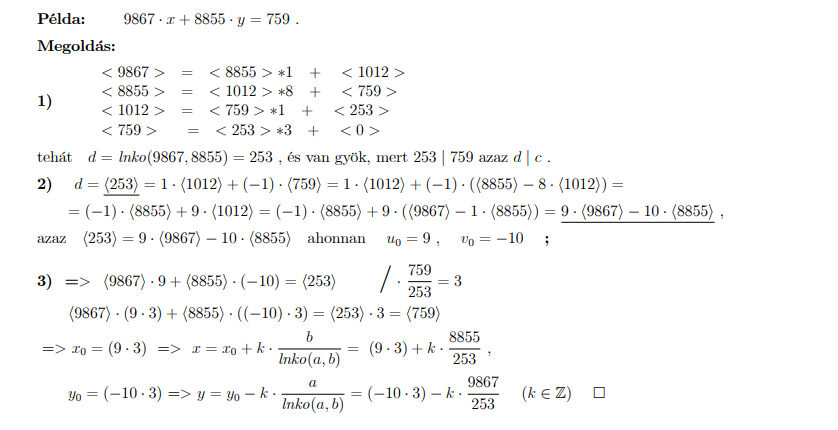
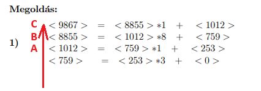

# Számelmélet Alapjai - Összefoglaló

## 1. Oszthatóság
**Jelölés:** $a | b$ (olvasva: $a$ osztója $b$-nek)

- **Definíció:** $a | b \iff \exists c \in \mathbb{Z} : b = a \cdot c$.
- **Maradék:** Az oszthatóság akkor áll fenn, ha az osztás maradéka 0.
- **Speciális esetek:** - Minden szám osztója a 0-nak ($n | 0$).
  - A 0 csak önmagának osztója (formálisan $0 | 0$ teljesül a definíció szerint).

### Oszthatósági szabály szorzatra
Ha $a | b$ és $c | b$, akkor a szorzatuk $(a \cdot c)$ csak akkor osztja $b$-t, ha $a$ és $c$ **relatív prímek**.
- Feltétel: $\text{lnko}(a, c) = 1$
- Példa: $3 | 12$ és $4 | 12 \implies 12 | 12$ (mivel $\text{lnko}(3,4)=1$).

---

## 2. Fontos összefüggések

### LNKO és LKKT kapcsolata
Tetszőleges $a, b$ egész számokra:
$$\text{lkkt}(a, b) = \frac{a \cdot b}{\text{lnko}(a, b)}$$

### Relatív prímek
Két szám relatív prím, ha nincs közös prímosztójuk, azaz:
$$\text{lnko}(a, b) = 1$$
*Példa:* $\text{lnko}(15, 14) = 1$, mert $15 = 3 \cdot 5$ és $14 = 2 \cdot 7$.

---

## 3. A Számelmélet Alaptétele
Minden $n \in \mathbb{N}, n > 1$ szám egyértelműen felírható prímhatványok szorzataként:
$$n = p_1^{\alpha_1} \cdot p_2^{\alpha_2} \cdot \dots \cdot p_k^{\alpha_k}$$

**Analógia:**
- **Prímszámok:** A matematika "atomjai", nem bonthatóak tovább szorzattá.
- **Egész számok:** A "molekulák", amiket prímek szorzata épít fel.
- **Multihalmaz:** A számokat a prímtényezőik halmazaként is kezelhetjük.
  - *Példa:* $12 = \{2, 2, 3\}$

## 4. Számelmélet és Halmazelmélet kapcsolata
Ha a számokat prímtényezőik multihalmazaként kezeljük (jelölése: $n_{\{\}}$), a műveletek a következőképpen feleltethetőek meg:

| Számelméleti fogalom | Halmazelméleti művelet | Jelentés |
| :--- | :--- | :--- |
| **LKKT** (legkisebb közös többszörös) | **Unió** ($\cup$) | Az összes prím a legnagyobb hatványon. |
| **LNKO** (legnagyobb közös osztó) | **Metszet** ($\cap$) | Csak a közös prímek. |
| **Oszthatóság** ($a \| b$) | **Részhalmaz** ($\subseteq$) | $a$ prímjei elemei $b$ prímjeinek. |

### Példa szemléltetésre:
Legyen $a = 12$ és $c = 18$.
- $12_{\{\}} = \{2, 2, 3\}$
- $18_{\{\}} = \{2, 3, 3\}$

1. **Metszet (LNKO):** $\{2, 2, 3\} \cap \{2, 3, 3\} = \{2, 3\} \rightarrow \mathbf{6}$
2. **Unió (LKKT):** $\{2, 2, 3\} \cup \{2, 3, 3\} = \{2, 2, 3, 3\} \rightarrow \mathbf{36}$
3. **Oszthatóság:** Mivel $\{2, 3\} \subseteq \{2, 2, 3\}$, ezért $6 | 12$ teljesül.

## 5. Boole-algebrai párhuzam és Disztributivitás

A számelmélet (oszthatóság, prímfelbontás) és a halmazelmélet (vagy Boole-algebra) között közvetlen szerkezeti hasonlóság van.

### Műveleti megfeleltetések
| Halmazművelet / Logika | Számelméleti művelet |
| :--- | :--- |
| **Unió** ($\cup$) / VAGY ($\lor$) | **LKKT** (legkisebb közös többszörös) |
| **Metszet** ($\cap$) / ÉS ($\land$) | **LNKO** (legnagyobb közös osztó) |

### Disztributivitási szabály (Széttagolhatóság)
A számelméleti műveletekre is igaz a disztributivitás, azaz az LKKT és az LNKO "felcserélhető" a zárójelbontásnál:

1. **LKKT az LNKO-ra nézve:**
   $$\text{lkkt}(a, \text{lnko}(b, c)) = \text{lnko}(\text{lkkt}(a, b), \text{lkkt}(a, c))$$

* **Mit jelent ez nekünk?** Ha van egy számunk, és annak keressük az LKKT-jét két másik szám LNKO-jával, akkor úgy is eljárhatunk, hogy a külső számot (a) külön-külön "össze-LKKT-zzuk" a belső számokkal, majd a kapott két eredménynek vesszük az LNKO-ját.
* **Példa:** Legyen $a=3$, $b=6$, és $c=9$.
  * **Bal oldal (eredeti alak):** Először kiszámoljuk a zárójelet: $\text{lnko}(6, 9) = 3$
    Utána a külső művelet: $\text{lkkt}(3, 3) = \mathbf{3}$
  * **Jobb oldal (bontott alak):** Először a két belső művelet: $\text{lkkt}(3, 6) = 6$, és $\text{lkkt}(3, 9) = 9$
    Végül ezek közös osztója: $\text{lnko}(6, 9) = \mathbf{3}$
  * *Látjuk, hogy a két oldal valóban megegyezik!*

2. **LNKO az LKKT-re nézve:**
   $$\text{lnko}(a, \text{lkkt}(b, c)) = \text{lkkt}(\text{lnko}(a, b), \text{lnko}(a, c))$$

* **Mit jelent ez nekünk?** Ez pontosan a fordítottja az előzőnek. Ha az LNKO van kívül és az LKKT belül, akkor az LNKO-t tudjuk tagonként bevinni a zárójelbe, a végén pedig a kapott eredményekből egy közös LKKT-t vonunk.
* **Példa:** Legyen $a=12$, $b=6$, és $c=8$.
  * **Bal oldal (eredeti alak):**
    Először a zárójel (többszörös): $\text{lkkt}(6, 8) = 24$
    Utána a külső művelet (osztó): $\text{lnko}(12, 24) = \mathbf{12}$
  * **Jobb oldal (bontott alak):**
    Először a két belső művelet (osztók): $\text{lnko}(12, 6) = 6$, és $\text{lnko}(12, 8) = 4$
    Végül ezek közös többszöröse: $\text{lkkt}(6, 4) = \mathbf{12}$
  * *Az egyenlőség itt is tökéletesen fennáll!*

---

## 6. Prímszámok definíciója
Egy $n \in \mathbb{P}$ szám prím, ha:
- $n > 1$ (az 1 nem prím!)
- Csak önmagával és 1-gyel osztható.
- Nem bontható fel kisebb egészek szorzatára: $n = x \cdot y \implies (x=1 \lor y=1)$.

## 7. Algoritmikus számelmélet és Bonyolultság

A számítástudományban a számelméleti problémáknál nem csak az eredmény a fontos, hanem az, hogy mennyi idő alatt kapjuk meg.

### A módosított "Eratoszthenész szitája" (Prímtesztelés naivan)

- Mit csinálunk? Elkezdjük osztani a számot 2-vel, 3-mal, 5-tel... egészen $\sqrt{n}$-ig. (Miért csak a gyökéig? Mert ha a szám felbontható $a \cdot b$ alakra, akkor az egyik osztónak biztosan kisebbnek vagy egyenlőnek kell lennie a négyzetgyöknél).
- Mennyi ideig tart ez? (Futási idő)A lépések száma nagyjából $\sqrt{n}$.De emlékezzünk, az input mérete az $N$ (a számjegyek száma)! Mivel $n \approx 10^N$, ezért $\sqrt{n} \approx \sqrt{10^N} = 10^{N/2}$.

- A nagy probléma: Ez az idő exponenciálisan lassú az $N$ számjegyek számához képest!A döbbenetes példa: Ha veszel egy 50-100 jegyű számot, a számítógépnek ezzel a primitív módszerrel nagyjából 36 milliárd évig tartana kideríteni, hogy prím-e!

### Input mérete
A futási időt nem a szám értéke ($n$), hanem a **számjegyeinek száma ($N$)** alapján mérjük. Miért? Mert a gép számjegyeket (biteket) olvas be. Egy 100 jegyű szám beolvasása 100 lépés, nem egy "nagyon nagy" lépés.
- Összefüggés: $N \approx \log_{10}(n)$ (tehát egy $n = 10^N$ nagyságrendű szám $N$ jegyű).

### A naiv prímtesztelés problémája (Próbaosztás)
Ha egy számról úgy akarjuk eldönteni, hogy prím-e, hogy elosztjuk az összes számmal $\sqrt{n}$-ig, a lépések száma arányos lesz $\sqrt{n}$-nel.
- Az $N$ számjegyhez viszonyítva ez $10^{N/2}$ lépést jelent.
- **Következtetés:** Ez az algoritmus **exponenciálisan lassú**. Egy 100 jegyű szám esetén a futási idő milliárd években mérhető. (kb 36 milliárd)

### A három fő számelméleti probléma (A kriptográfia alapjai)

| Probléma | Feladat | Van-e gyors (polinomiális) algoritmus? |
| :--- | :--- | :--- |
| **1. Prímtesztelés** | Eldönteni egy nagy $n$ számról, hogy prím-e. | **IGEN** (pl. AKS algoritmus, 2002). Gyorsan ellenőrizhető. |
| **2. Faktorizáció** (Felbontás) | Megtalálni egy összetett szám prímtényezőit ($n = x \cdot y$). | **NINCS** (Hagyományos gépeken). Ez adja az RSA titkosítás biztonságát! |
| **3. Prímkeresés** | Egy adott méretű (pl. 500 jegyű) véletlen prím generálása. | **IGEN** (Valószínűségi tesztekkel gyorsan megoldható). |

> **A lényeg a vizsgára:** Nagyon könnyű összeszorozni két 500 jegyű prímet (gyors). De ha csak az eredményt kapjuk meg, iszonyatosan nehéz (exponenciálisan lassú) visszafejteni belőle a két eredeti prímet (faktorizáció).

## 8. Algoritmikus problémák összefüggései

A három fő algoritmikus probléma (Prímtesztelés, Prímfelbontás, Prímgenerálás) közül a **Prímfelbontás (ii)** a legnehezebb.
- Ha a prímfelbontást meg tudnánk oldani gyorsan, azzal megoldanánk a másik kettőt is: `(ii) => (i)` és `(ii) => (iii)`.
- Mivel a prímfelbontás exponenciálisan lassú (pl. Eratoszthenészi szitával), a számítógépek számára a gyakorlatban használhatatlan nagy (több száz jegyű) számok esetén.

### Nagyon fontos következmény az algoritmusok tervezésénél!
Mivel a prímfelbontás lassú, **MINDEN** olyan algoritmus, ami erre épül, szintén lassú lesz nagy inputok esetén.
- **Példa:** Bár matematikailag helyes az LNKO-t (Legnagyobb közös osztót) a prímek metszeteként megkeresni, a programozásban ez tilos, mert túl lassú! (Helyette az Euklideszi algoritmust használják).

---

## 9. A Nagy Prímszámtétel

A prímszámok eloszlását írja le a számegyenesen. Azt mutatja meg, milyen "sűrűn" helyezkednek el a prímek.

**Jelölés:** $\pi(n)$ megadja, hogy hány darab prímszám van $1$-től $n$-ig.

**A tétel kimondja:** Nagyon nagy számok esetén ($n \to \infty$) a prímek száma így közelíthető:
$$\pi(n) \sim \frac{n}{\log n}$$

**Valószínűségi megközelítés:**
$$\frac{\pi(n)}{n} \sim \frac{1}{\log n}$$
Ez azt jelenti, hogy ha véletlenszerűen kiválasztunk egy $n$-nél kisebb egész számot, akkor annak a valószínűsége, hogy ez a szám prím, megközelítőleg $\frac{1}{\log n}$. (Ahogy haladunk a nagy számok felé, a prímek egyre "ritkábban" fordulnak elő).

## 10. Maradékos osztás és Euklideszi algoritmus

### Maradékos osztás tétele
Bármely $a$ és $b$ ($b > 0$) egész számok esetén egyértelműen létezik egy $q$ (hányados) és egy $r$ (maradék) szám, amelyre igaz, hogy:
$$a = b \cdot q + r \quad \text{ahol} \quad 0 \le r < b$$
*(Magyarul: A maradék mindig nemnegatív, és kisebb az osztónál).*

### Euklideszi algoritmus
Ez a leggyorsabb módszer két szám legnagyobb közös osztójának (LNKO) megkeresésére, prímfelbontás nélkül.

**A módszer lépései:**
1. Felírjuk a maradékos osztást a két számra ($a = b \cdot q + r$).
2. A következő sorban az előző sor **osztója lesz az új elosztandó** ($a$ helyére kerül), és az előző sor **maradéka lesz az új osztó** ($b$ helyére kerül). "Balra csúsztatunk".
3. Ezt az eljárást addig folytatjuk, amíg a **maradék 0 nem lesz**.
4. Az LNKO mindig az **utolsó nem nulla maradék**.

**Példa: lnko(48, 18) = ?**
1. $48 = \mathbf{18} \cdot 2 + \mathbf{12}$
2. $18 = \mathbf{12} \cdot 1 + \mathbf{6}$
3. $12 = 6 \cdot 2 + 0 \rightarrow \text{STOP!}$
**Eredmény:** Az utolsó nem nulla maradék a 6, tehát $\text{lnko}(48, 18) = \mathbf{6}$.

---

## 11. Kongruenciák alapjai (Maradékaritmetika)

A számelméletben a kongruencia azt vizsgálja, hogy számok milyen maradékot adnak egy adott számmal osztva.

**Definíció és Jelölés:**
$$a \equiv b \pmod m$$
*(Olvasva: a kongruens b-vel modulo m)*

**Jelentése (a kettő egyenértékű):**
1. Az $a$ számot $m$-mel osztva **ugyanannyi a maradék**, mintha $b$-t osztanánk $m$-mel.
2. Az $a - b$ különbség maradék nélkül **osztható** $m$-mel ($m | (a-b)$).

**Példa (Óramatematika - mod 12):**
$14 \equiv 2 \pmod{12}$, mert mindkettő 2 maradékot ad 12-vel osztva (vagy: $14 - 2 = 12$, ami osztható 12-vel).

**Kapcsolat a vizsgafeladatokkal:**
A lineáris kongruenciák (pl. $ax \equiv b \pmod m$) megoldásához gyakran a **Bővített Euklideszi algoritmust** kell használni, amely az alap Euklideszi algoritmus lépéseiből "visszafele" indulva megtalálja a szorzás inverzét a modulos világban.

## 12. Gyakori buktatók és trükkök az osztásnál

### Kisebb szám osztása nagyobbal
Ha egy $a$ számot osztunk egy nála nagyobb $b$ számmal ($a < b$), akkor a maradékos osztás eredménye mindig a következő:
- **Hányados:** 0
- **Maradék:** Maga az $a$ szám.
- **Példa:** $2 \div 12 \rightarrow$ megvan benne 0-szor, a maradék 2. Képlettel: $2 = 12 \cdot 0 + 2$.

---

## 13. Mire használjuk az LNKO-t a gyakorlatban? (A vizsga szempontjából)

Az Euklideszi algoritmussal kapott LNKO (Legnagyobb Közös Osztó) egy "döntéshozó eszköz" a bonyolultabb feladatokhoz.

1. **Relatív prímek tesztelése:**
   Ha $\text{lnko}(a, b) = 1$, akkor a két szám relatív prím. A kriptográfiában (pl. RSA) és a kongruencia egyenletek megoldásánál (inverz keresése) ez a legfontosabb feltétel!

2. **Lineáris kongruenciák megoldhatósága:**
   Adott egy egyenlet: $a \cdot x \equiv c \pmod m$
   - Kiszámoljuk $a$ és $m$ legnagyobb közös osztóját: $d = \text{lnko}(a, m)$.
   - **A szabály:** Az egyenletnek **csak akkor** van megoldása, ha a kapott $d$ (LNKO) maradék nélkül osztja a $c$ számot ($d | c$).
   - **Példa:** $18x \equiv 15 \pmod{48}$. Mivel $\text{lnko}(18, 48) = 6$, és a $6$ nem osztója a $15$-nek, az egyenletnek **nincs megoldása**. (Ha $18x \equiv 12 \pmod{48}$ lenne, akkor lenne megoldás, mert $6|12$).

## 14. Az Euklideszi Algoritmus hatékonysága és tulajdonságai

Az Euklideszi algoritmus nemcsak helyes, de számítástudományi szempontból is tökéletes algoritmus.

### Algoritmus-analízis szempontok:
1. **Végesség (Megállás):** Az algoritmus garantáltan megáll. A maradékok sorozata szigorúan monoton csökken ($b > r_1 > r_2 > \dots > 0$), és mivel diszkrét egész számokról van szó, véges lépésben el kell érnie a nullát.
2. **Bonyolultság:** Programozási szempontból triviális, egyetlen egyszerű ciklussal implementálható (O(1) memóriahasználat).
3. **Futási idő és Lamé tétele:**
   Lamé tétele megadja az algoritmus maximális lépésszámát.
   - **Tétel:** $m \le 5 \cdot \log_{10}(|b|)$ (ahol $m$ a lépések száma, $b$ a kisebbik szám).
   - **Jelentése:** A lépések száma sosem haladja meg a kisebbik szám decimális (10-es alapú) **számjegyei számának ötszörösét**. (Polinomiális futási idő, extrém gyors).

---

## 15. Kiterjesztés több változóra

Az LNKO és az LKKT fogalma és kiszámítása kiterjeszthető 2-nél több számra is, páronkénti (láncolt) kiértékeléssel.

**Több szám LNKO-ja:**
Kiszámítjuk az első kettő LNKO-ját, majd a kapott eredménynek és a harmadik számnak az LNKO-ját, és így tovább.
$$\text{lnko}(a, b, c) = \text{lnko}(\text{lnko}(a, b), c)$$

Általánosítva $n$ darab számra:
$$\text{lnko}(a_1, a_2, \dots, a_n) = \text{lnko}(\dots\text{lnko}(\text{lnko}(a_1, a_2), a_3) \dots, a_n)$$

*(Megjegyzés: Az LKKT-ra is ugyanez a "láncolási" szabály vonatkozik!)*

## 16. Lineáris Diophantoszi Egyenletek

Olyan egyenletek, ahol **csak egész számos** ($x, y \in \mathbb{Z}$) megoldásokat keresünk.

### A Megoldhatóság Alaptétele (Bármennyi ismeretlenre)
Az $a_1x_1 + a_2x_2 + \dots + a_nx_n = c$ egyenlet akkor és csak akkor oldható meg az egész számok halmazán, ha a bal oldali együtthatók Legnagyobb Közös Osztója maradék nélkül osztja a jobb oldalt:
**Feltétel:** $\text{lnko}(a_1, a_2, \dots, a_n) | c$

---

### Kétismeretlenes Egyenlet Megoldási Algoritmusa (ax + by = c)

**1. Lépés: Létezik-e megoldás?**
Számítsuk ki: $d = \text{lnko}(a, b)$.
- Ha $d \nmid c$ (nem osztja), az egyenletnek **nincs megoldása**.
- Ha $d \mid c$, az egyenletnek **végtelen sok megoldása** van, lépjünk a 2. lépésre.

**2. Lépés: Egy partikuláris (konkrét) megoldás keresése**
- Oldjuk meg a Bővített Euklideszi algoritmussal az $a \cdot u_0 + b \cdot v_0 = d$ egyenletet.
- Szorozzuk be az eredményeket $\frac{c}{d}$-vel, hogy megkapjuk az eredeti egyenlet egy konkrét megoldását:
  $$x_0 = u_0 \cdot \frac{c}{d} \quad \text{és} \quad y_0 = v_0 \cdot \frac{c}{d}$$

**3. Lépés: Az összes megoldás felírása**
Minden megoldás előállítható egy $k \in \mathbb{Z}$ (tetszőleges egész szám) paraméter segítségével. A képlet:
$$x = x_0 + k \cdot \frac{b}{\text{lnko}(a, b)}$$
$$y = y_0 - k \cdot \frac{a}{\text{lnko}(a, b)}$$

*(Figyelem: A képletekben az egyik helyen plusz, a másikon mínusz jel van az egyensúly megtartása miatt!)*

#### Példa feladat

- **1.:** lépésben az lnko(a,b) -t ki kell számolni ( Ebben az esetben lnko(9867,8855))
- **2.:** lépésben az lnk(a,b)-t alulról felfelé kell visszafejteni egy engyenletrendszerré. 
  - 
  - **A:** Fejezzük ki a 253-at. (Átvisszük a többit a másik oldalra).
$\mathbf{253} = 1 \cdot \langle 1012 \rangle - 1 \cdot \langle 759 \rangle$
  - **B:**  a <759>-es "dobozban" lévőt helyettesítjük be a zárójel  A 2. sorból fejezzük ki a $\langle 759 \rangle$-et: $\langle 759 \rangle = \langle 8855 \rangle - 8 \cdot \langle 1012 \rangle$. Ezt a zárójeles kifejezést írjuk be az előző egyenletbe a $\langle 759 \rangle$ helyére!
$253 = 1 \cdot \langle 1012 \rangle - 1 \cdot \mathbf{(\langle 8855 \rangle - 8 \cdot \langle 1012 \rangle)}$
Fejezzük ki a 253-at. (Átvisszük a többit a másik oldalra).
$\mathbf{253} = 1 \cdot \langle 1012 \rangle - 1 \cdot \langle 759 \rangle$
Vonjuk össze az azonos dobozokat (van 1 db 1012-es és 8 db 1012-es dobozunk, az összesen 9 db):
$253 = \mathbf{9 \cdot \langle 1012 \rangle} - 1 \cdot \langle 8855 \rangle$   
   - **C:** Az 1. sorból fejezzük ki az $\langle 1012 \rangle$-t: $\langle 1012 \rangle = \langle 9867 \rangle - 1 \cdot \langle 8855 \rangle$. Ezt helyettesítsük be a $\langle 1012 \rangle$ doboz helyére!
$253 = 9 \cdot \mathbf{(\langle 9867 \rangle - 1 \cdot \langle 8855 \rangle)} - 1 \cdot \langle 8855 \rangle$
Bontsunk zárójelet:
$253 = 9 \cdot \langle 9867 \rangle - 9 \cdot \langle 8855 \rangle - 1 \cdot \langle 8855 \rangle$
Vonjuk össze az azonos dobozokat (van -9 db 8855-ösünk és még -1 db, az összesen -10 db):
$\mathbf{253 = 9 \cdot \langle 9867 \rangle - 10 \cdot \langle 8855 \rangle}$
Az $x$ helyén lévő szorzó az $u_0 = 9$, az $y$ helyén lévő szorzó a $v_0 = -10$.

- **3.:**  A Partikuláris és Általános megoldás
  - Cél: Nekünk nem a 253-ra (LNKO) kell megoldani az egyenletet, hanem a feladatban szereplő 759-re!Felszorzás: Hányszorosa a 759 a 253-nak? $759 \div 253 = \mathbf{3}$.Szorozzuk be az egész előzőleg kapott egyenletünket 3-mal!$(9 \cdot 3) \cdot \langle 9867 \rangle + (-10 \cdot 3) \cdot \langle 8855 \rangle = 253 \cdot 3$$\mathbf{27 \cdot \langle 9867 \rangle - 30 \cdot \langle 8855 \rangle = 759}$Ebből leolvasható az első, konkrét megoldáspár (partikuláris megoldás):$x_0 = 27$$y_0 = -30$Az összes megoldás (Általános megoldás): Most csak be kell helyettesíteni abba a bizonyos képletbe, amit az előző jegyzetben néztünk:$x = x_0 + k \cdot \frac{b}{\text{LNKO}} \implies x = 27 + k \cdot \frac{8855}{253} \implies \mathbf{x = 27 + k \cdot 35}$$y = y_0 - k \cdot \frac{a}{\text{LNKO}} \implies y = -30 - k \cdot \frac{9867}{253} \implies \mathbf{y = -30 - k \cdot 39}$(Ahol a $k$ tetszőleges egész szám).     