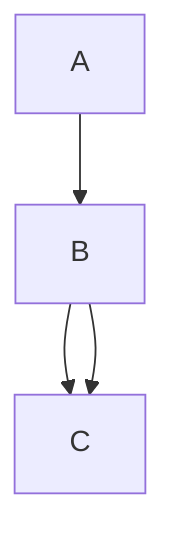

**Alapok**

**f : A -> B = f :A -> B  f függvény, és Dom(f) A** 
  -> Dom(f) Dominium (Terület) latin szóból ered ami az értelmezési tartományt jelenti. 
  ->  f: A -> B  f olyan függvény amelyben A elemeit hozzárendeljük B-hez, 

További jelölésektől ledobtam a láncot. Erre most nem pazaroltam az időt, mentem tovább az első fejezethez. =(

# Halmazok  

**A középiskolai definició hibás:** " halmaz = azonos tulajdonságú elemek összessége"

**Cantor-tétel viszont kijelenti:** Nem létezik olyan halmaz, ami a világon MINDENT tartalmaz. Nincs egy „Szuper-Mindent-Bele Doboz”.

TFH mégis van ez a mindent tartalmazó doboz ->  ($Y := \{x \in Z \mid x \notin x\}$)

-  Vannak olyan halmazok amelyek nem tartalmazzák saját magukat.  

## Lépés: "Tartalmazza-e önmagát?"
Képzelj el egy hatalmas könyvtárat, ahol a könyvtáros különféle katalógusokat (listákat) készít a könyvekről. Egy katalógus is egy könyv, csak listák vannak benne.

Kétféle katalógus létezik:

Az 1. típus (NEM tartalmazza önmagát): Például a "Szakácskönyvek katalógusa". Mivel ez a könyv maga egy katalógus, és nem egy szakácskönyv, ezért nem írja bele saját magát a saját listájába. A dobozos példában ez az "almák halmaza", ami maga nem egy alma.

A 2. típus (TARTALMAZZA önmagát): Például a "Magyar nyelven nyomtatott könyvek katalógusa". Mivel ez a katalógus is magyarul van nyomtatva, ezért bele kell írnia a saját címét is a listába! Tehát ez a lista tartalmazza saját magát.

## Lépés: Hozzuk létre az $Y$ katalógust!

Nézzük a képletet, amit írtál, és fordítsuk le magyarra:
- $Y := \{x \in Z \mid x \notin x\}$$Y :=$ 
Jelentsen az $Y$ katalógus...
- $\{x \in Z \mid$ ... egy olyan gyűjteményt a világ összes dolga ($Z$) közül, amire igaz az a szabály, hogy...
- $x \notin x \}$ ...az adott dolog ($x$) nincs benne önmagában ($x$-ben).

## 3. Lépés: A bumm (Miért esik szét az agyunk?)

A könyvtáros szépen megírja ezt az $Y$ katalógust. De amikor a végére ér, feltesz magának egy kérdést, miközben a kezében tartja a kész $Y$ könyvet:"Vajon ezt az $Y$ katalógust beírjam-e a saját magába, vagy sem?"

### Logikai csapda:

- Ha BEÍRJA: Ha beírja magát a listába, akkor $Y$ egy olyan katalógus lett, ami tartalmazza önmagát. De várjunk! Az $Y$ borítójára az van írva, hogy ide CSAK azokat szabad beírni, amik nem tartalmazzák önmagukat. Tehát ki kell radírozni!
- Ha NEM ÍRJA BE (kiradírozza): Ha nincs benne a listában, akkor $Y$ egy olyan katalógus, ami nem tartalmazza önmagát. De várjunk! Az $Y$ szabálya az volt, hogy minden ilyet KÖTELEZŐ beírni! Tehát mégis be kell írni!

### 1.2-es definició

#### 1. Minden vizsgált objektum halmaz, lehet eleme egy másik halmaznak, nincs elem és halmaz megkülönböztetés.

#### 2. Tetszőleges x és A esetén az x ∈ A és az x ∉ A relációk közül pontosan az egyik teljesül. 
- Egy tetszőleges A halmaz pontosan akkor egyértelműen megadott vagy meghatározott, ha tetszőleges x esetén az x ∈ A és az x ∉ A relációk közül egyértelmű hogy melyik áll fenn.
#### 3.  Két tetszőleges A , B halmaz pontosan akkor azonos, A=B , ha tetszőleges x esetén az x ∈ A és az x ∈ B relációk ugyanakkor teljesülnek (ill. nem teljesülnek).
#### 4. Egy tetszőleges A halmaz üres halmaz, ha minden x esetén x ∉ A teljesül

### 1.3-es definició

#### Üres halmaz (legfeljebb) csak egy lehet.

Bizonyítás: Ha A és B mindkettő üres halmaz, akkor minden x esetén az x ∉ A és az x ∉ B relációk mindegyike teljesül, vagyis a (iii) axióma szerint A = B

## Boole- algebrák
## 1.4. Állítás

Tetszőleges $A, B, C \subseteq I$ halmazokra teljesülnek az alábbi azonosságok:

### Kommutativitás
- (BA1)  
  $$
  A \cup B = B \cup A
  $$
- (BA2)  
  $$
  A \cap B = B \cap A
  $$

- A kommutativitás azt jelenti, hogy egy adott művelet elvégzésekor a halmazok (az operandusok) sorrendje felcserélhető, és ez nem változtatja meg a végeredményt.

### Asszociativitás
- (BA3)  
  $$
  A \cup (B \cup C) = (A \cup B) \cup C
  $$
- (BA4)  
  $$
  A \cap (B \cap C) = (A \cap B) \cap C
  $$

- Az asszociativitás, vagyis a csoportosíthatóság azt jelenti, hogy ha három vagy több halmazon végig ugyanazt a műveletet (például csak uniót vagy csak metszetet) hajtjuk végre, akkor a műveletek elvégzésének sorrendjét kijelölő zárójelek szabadon áthelyezhetők, mert a végeredmény minden esetben változatlan marad.

PL:
- $A \cup (B \cup C) = (A \cup B) \cup C$ (BA3): Képzeld el, hogy turmixot csinálsz eperből ($A$), banánból ($B$) és tejből ($C$). Teljesen mindegy, hogy először a banánt és a tejet turmixolod össze (ez a zárójel), és utána dobod bele az epret, vagy először az epret és a banánt pépesíted, majd felöntöd tejjel. A végeredmény pontosan ugyanaz az epres-banános turmix lesz.
- $A \cap (B \cap C) = (A \cap B) \cap C$ (BA4): Itt a közös tulajdonságokat keressük három embernél 
($A, B, C$). Mindegy, hogy először megnézed, mi a közös $B$-ben és $C$-ben (zárójel), majd megnézed, hogy $A$-nak mi a közös ezzel a szűkített listával; vagy először $A$ és $B$ közös dolgait keresed meg, és ahhoz nézed hozzá $C$-t. A végén kapott "közös metszet" hajszálpontosan ugyanaz marad.

### Disztributivitás
- (BA5)  
  $$
  A \cup (B \cap C) = (A \cup B) \cap (A \cup C)
  $$
- (BA6)  
  $$
  A \cap (B \cup C) = (A \cap B) \cup (A \cap C)
  $$

- $A \cap (B \cup C) = (A \cap B) \cup (A \cap C)$ (BA6)Képzeld el, hogy teát készítesz, és a következő "halmazokból" válogathatsz:$A$: 
  - Fekete tea$B$:
  - Citrom$C$:
  - Cukor 
- A bal oldal jelentése ($A \cap (B \cup C)$): Kérsz egy Fekete teát ($A$), ÉS ($\cap$) mellé ízesítésnek kérsz Citromot VAGY Cukrot ($B \cup C$).
- A jobb oldal jelentése ($(A \cap B) \cup (A \cap C)$): Ez a rendelés pontosan ugyanazt jelenti, mintha azt mondanád a pincérnek: "Kérek egy citromos fekete teát ($A \cap B$) VAGY egy cukros fekete teát ($A \cap C$)".

"A disztributivitás (széttagolhatóság vagy zárójelbontás) azt jelenti, hogy amikor egy halmazműveletet (pl. metszetet) egy másik művelettel (pl. unióval) összekapcsolt halmazokon végzünk el, akkor a külső műveletet tagonként 'bevihetjük' a zárójelbe, pontosan úgy, ahogy az algebrában a szorzást felbontjuk az összeadáson."

Ez pontosan ugyanúgy működik mint ha azt csinálom, hogy: 
- A 2 * (3+4) = 3+4 = 7 és 7*2  =14
- Vagy ha felbntom a zárójelet, is ugyyanazt a számot kapom: 2*3 + 2*4 = 14 

### Elnyelési tulajdonságok
- (BA7)  
  $$
  A \cup (A \cap B) = A
  $$
- (BA8)  
  $$
  A \cap (A \cup B) = A
  $$

- **BA7** - $A \cup (A \cap B) = A$ 
  - Mi az az $(A \cap B)$? Ők a te ismerőseid közül azok, akik szeretik a pizzát (a közös rész). Ez egy kisebb csoport, ami teljesen benne van a te ismerőseid körében ($A$).
  - Most jön a külső művelet ($\cup$): Fogd az összes ismerősödet ($A$), és "öntsd hozzájuk" azokat az ismerőseidet, akik szeretik a pizzát.
  - Mi történik? Semmi! Nem adtál hozzá senki újat a csapathoz, hiszen ők már eleve ott voltak az ismerőseid között. A nagy halmaz ($A$) egyszerűen elnyelte a felesleges kört, az eredmény maradt simán $A$.

- **(BA8)** - $A \cap (A \cup B) = A$
    - Mi az az $(A \cup B)$? Egy hatalmas tömeg: mindenki, aki vagy a te ismerősöd, vagy szereti a pizzát (vagy mindkettő).
    - Most jön a külső művelet ($\cap$): Keresd meg a közös részt a te ismerőseid ($A$) és e között a hatalmas tömeg között.
    - Mivel a te ismerőseid mind ott állnak ebben a hatalmas tömegben, a "közös rész" pontosan a te ismerőseid csapata lesz. Megint eltűnt a $B$, az eredmény simán $A$ maradt.

- Az elnyelési tulajdonság (abszorpció) azt mondja ki, hogy ha egy halmazt uniózunk vagy metszünk egy olyan kifejezéssel, amelyben ő maga is szerepel a másik fajta művelettel összekötve, akkor a kívül lévő halmaz teljesen 'elnyeli' a zárójeles részt, így a végeredmény önmaga marad.

### $\emptyset$ és $I$ tulajdonságai
- (BA9)  
  $$
  A \cup \overline{A} = I
  $$
- (BA10)  
  $$
  A \cap \overline{A} = \emptyset
  $$
- (BA11)  
  $$
  A \cup \emptyset = A
  $$
- (BA12)  
  $$
  A \cap \emptyset = \emptyset
  $$
- (BA13)  
  $$
  A \cup I = I
  $$
- (BA14)  
  $$
  A \cap I = A
  $$

- A halmaz és az ellentéte (komplementere):
- $A \cup \overline{A} = I$ (BA9): 
  - Ha egy óriási teremben összeöntöd a te almáidat ($A$) az összes olyan dologgal, ami nem a te almád ($\overline{A}$), akkor logikus, hogy megkapod a világ összes létező dolgát ($I$).
- $A \cap \overline{A} = \emptyset$ (BA10):
  -  Mi a közös ($\cap$) a te almáidban és azokban a dolgokban, amik nem a te almáid? Semmi! Nem lehetsz egyszerre bent is meg kint is. Ezért az eredmény az üres halmaz ($\emptyset$).

**Találkozás a "Semmivel" ($\emptyset$)**
- :$A \cup \emptyset = A$ (BA11): Ha a te dobozodhoz ($A$) hozzáöntesz ($\cup$) egy teljesen üres dobozt ($\emptyset$), akkor nem változik semmi, marad a te dobozod ($A$). (Mintha a matekban hozzáadnál nullát).
- - $A \cap \emptyset = \emptyset$ (BA12): Mi a közös ($\cap$) a te dobozod és egy teljesen üres doboz tartalmában? Hát a semmi! Ezért a közös rész üres lesz. (Mintha a matekban szoroznál nullával).

**Találkozás a "Mindenséggel" ($I$):$A \cup I = I$ (BA13):** 
- Ha a te dobozodat bedobod a Világmindenség hatalmas dobozába, és összekevered őket ($\cup$), a végeredmény egyszerűen a Világmindenség marad ($I$), hiszen a te kis dobozod már eleve része volt a nagy egésznek.
- $A \cap I = A$ (BA14): Mi a közös ($\cap$) a te dobozodban ($A$) és a világ összes dolgában ($I$)? Pontosan a te dobozod tartalma! Hiszen a te dolgaid is a világ részei.

Az üres halmaz ($\emptyset$) és az alaphalmaz ($I$) azonosságai megmutatják, hogy ha egy halmazt a 'semmivel' ($\emptyset$), a 'mindenséggel' ($I$), vagy a saját ellentétével ($\overline{A}$) vonunk össze unióval vagy metszettel, akkor a végeredmény mindig egy alapvető halmazzá (önmagává, az üres halmazzá vagy az alaphalmazzá) egyszerűsödik.

