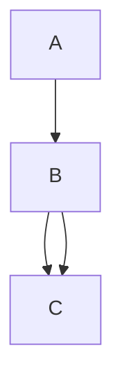

**Alapok**

**f : A -> B = f :A -> B  f függvény, és Dom(f) A** 
  -> Dom(f) Dominium (Terület) latin szóból ered ami az értelmezési tartományt jelenti. 
  ->  f: A -> B  f olyan függvény amelyben A elemeit hozzárendeljük B-hez, 

További jelölésektől ledobtam a láncot. Erre most nem pazaroltam az időt, mentem tovább az első fejezethez. =(

# Halmazok  

**A középiskolai definició hibás:** " halmaz = azonos tulajdonságú elemek összessége"

**Cantor-tétel viszont kijelenti:** Nem létezik olyan halmaz, ami a világon MINDENT tartalmaz. Nincs egy „Szuper-Mindent-Bele Doboz”.

TFH mégis van ez a mindent tartalmazó doboz ->  ($Y := \{x \in Z \mid x \notin x\}$)

-  Vannak olyan halmazok amelyek nem tartalmazzák saját magukat.  

## Lépés: "Tartalmazza-e önmagát?"
Képzelj el egy hatalmas könyvtárat, ahol a könyvtáros különféle katalógusokat (listákat) készít a könyvekről. Egy katalógus is egy könyv, csak listák vannak benne.

Kétféle katalógus létezik:

Az 1. típus (NEM tartalmazza önmagát): Például a "Szakácskönyvek katalógusa". Mivel ez a könyv maga egy katalógus, és nem egy szakácskönyv, ezért nem írja bele saját magát a saját listájába. A dobozos példában ez az "almák halmaza", ami maga nem egy alma.

A 2. típus (TARTALMAZZA önmagát): Például a "Magyar nyelven nyomtatott könyvek katalógusa". Mivel ez a katalógus is magyarul van nyomtatva, ezért bele kell írnia a saját címét is a listába! Tehát ez a lista tartalmazza saját magát.

## Lépés: Hozzuk létre az $Y$ katalógust!

Nézzük a képletet, amit írtál, és fordítsuk le magyarra:
- $Y := \{x \in Z \mid x \notin x\}$$Y :=$ 
Jelentsen az $Y$ katalógus...
- $\{x \in Z \mid$ ... egy olyan gyűjteményt a világ összes dolga ($Z$) közül, amire igaz az a szabály, hogy...
- $x \notin x \}$ ...az adott dolog ($x$) nincs benne önmagában ($x$-ben).

## 3. Lépés: A bumm (Miért esik szét az agyunk?)

A könyvtáros szépen megírja ezt az $Y$ katalógust. De amikor a végére ér, feltesz magának egy kérdést, miközben a kezében tartja a kész $Y$ könyvet:"Vajon ezt az $Y$ katalógust beírjam-e a saját magába, vagy sem?"

### Logikai csapda:

- Ha BEÍRJA: Ha beírja magát a listába, akkor $Y$ egy olyan katalógus lett, ami tartalmazza önmagát. De várjunk! Az $Y$ borítójára az van írva, hogy ide CSAK azokat szabad beírni, amik nem tartalmazzák önmagukat. Tehát ki kell radírozni!
- Ha NEM ÍRJA BE (kiradírozza): Ha nincs benne a listában, akkor $Y$ egy olyan katalógus, ami nem tartalmazza önmagát. De várjunk! Az $Y$ szabálya az volt, hogy minden ilyet KÖTELEZŐ beírni! Tehát mégis be kell írni!

### 1.2-es definició

#### 1. Minden vizsgált objektum halmaz, lehet eleme egy másik halmaznak, nincs elem és halmaz megkülönböztetés.

#### 2. Tetszőleges x és A esetén az x ∈ A és az x ∉ A relációk közül pontosan az egyik teljesül. 
- Egy tetszőleges A halmaz pontosan akkor egyértelműen megadott vagy meghatározott, ha tetszőleges x esetén az x ∈ A és az x ∉ A relációk közül egyértelmű hogy melyik áll fenn.
#### 3.  Két tetszőleges A , B halmaz pontosan akkor azonos, A=B , ha tetszőleges x esetén az x ∈ A és az x ∈ B relációk ugyanakkor teljesülnek (ill. nem teljesülnek).
#### 4. Egy tetszőleges A halmaz üres halmaz, ha minden x esetén x ∉ A teljesül

### 1.3-es definició

#### Üres halmaz (legfeljebb) csak egy lehet.

Bizonyítás: Ha A és B mindkettő üres halmaz, akkor minden x esetén az x ∉ A és az x ∉ B relációk mindegyike teljesül, vagyis a (iii) axióma szerint A = B

## Boole- algebrák
## 1.4. Állítás

Tetszőleges $A, B, C \subseteq I$ halmazokra teljesülnek az alábbi azonosságok:

### Kommutativitás
- (BA1)  
  $$
  A \cup B = B \cup A
  $$
- (BA2)  
  $$
  A \cap B = B \cap A
  $$

- A kommutativitás azt jelenti, hogy egy adott művelet elvégzésekor a halmazok (az operandusok) sorrendje felcserélhető, és ez nem változtatja meg a végeredményt.

### Asszociativitás
- (BA3)  
  $$
  A \cup (B \cup C) = (A \cup B) \cup C
  $$
- (BA4)  
  $$
  A \cap (B \cap C) = (A \cap B) \cap C
  $$

- Az asszociativitás, vagyis a csoportosíthatóság azt jelenti, hogy ha három vagy több halmazon végig ugyanazt a műveletet (például csak uniót vagy csak metszetet) hajtjuk végre, akkor a műveletek elvégzésének sorrendjét kijelölő zárójelek szabadon áthelyezhetők, mert a végeredmény minden esetben változatlan marad.

PL:
- $A \cup (B \cup C) = (A \cup B) \cup C$ (BA3): Képzeld el, hogy turmixot csinálsz eperből ($A$), banánból ($B$) és tejből ($C$). Teljesen mindegy, hogy először a banánt és a tejet turmixolod össze (ez a zárójel), és utána dobod bele az epret, vagy először az epret és a banánt pépesíted, majd felöntöd tejjel. A végeredmény pontosan ugyanaz az epres-banános turmix lesz.
- $A \cap (B \cap C) = (A \cap B) \cap C$ (BA4): Itt a közös tulajdonságokat keressük három embernél 
($A, B, C$). Mindegy, hogy először megnézed, mi a közös $B$-ben és $C$-ben (zárójel), majd megnézed, hogy $A$-nak mi a közös ezzel a szűkített listával; vagy először $A$ és $B$ közös dolgait keresed meg, és ahhoz nézed hozzá $C$-t. A végén kapott "közös metszet" hajszálpontosan ugyanaz marad.

### Disztributivitás
- (BA5)  
  $$
  A \cup (B \cap C) = (A \cup B) \cap (A \cup C)
  $$
- (BA6)  
  $$
  A \cap (B \cup C) = (A \cap B) \cup (A \cap C)
  $$

- $A \cap (B \cup C) = (A \cap B) \cup (A \cap C)$ (BA6)Képzeld el, hogy teát készítesz, és a következő "halmazokból" válogathatsz:$A$: 
  - Fekete tea$B$:
  - Citrom$C$:
  - Cukor 
- A bal oldal jelentése ($A \cap (B \cup C)$): Kérsz egy Fekete teát ($A$), ÉS ($\cap$) mellé ízesítésnek kérsz Citromot VAGY Cukrot ($B \cup C$).
- A jobb oldal jelentése ($(A \cap B) \cup (A \cap C)$): Ez a rendelés pontosan ugyanazt jelenti, mintha azt mondanád a pincérnek: "Kérek egy citromos fekete teát ($A \cap B$) VAGY egy cukros fekete teát ($A \cap C$)".

"A disztributivitás (széttagolhatóság vagy zárójelbontás) azt jelenti, hogy amikor egy halmazműveletet (pl. metszetet) egy másik művelettel (pl. unióval) összekapcsolt halmazokon végzünk el, akkor a külső műveletet tagonként 'bevihetjük' a zárójelbe, pontosan úgy, ahogy az algebrában a szorzást felbontjuk az összeadáson."

Ez pontosan ugyanúgy működik mint ha azt csinálom, hogy: 
- A 2 * (3+4) = 3+4 = 7 és 7*2  =14
- Vagy ha felbntom a zárójelet, is ugyyanazt a számot kapom: 2*3 + 2*4 = 14 

### Elnyelési tulajdonságok
- (BA7)  
  $$
  A \cup (A \cap B) = A
  $$
- (BA8)  
  $$
  A \cap (A \cup B) = A
  $$

- **BA7** - $A \cup (A \cap B) = A$ 
  - Mi az az $(A \cap B)$? Ők a te ismerőseid közül azok, akik szeretik a pizzát (a közös rész). Ez egy kisebb csoport, ami teljesen benne van a te ismerőseid körében ($A$).
  - Most jön a külső művelet ($\cup$): Fogd az összes ismerősödet ($A$), és "öntsd hozzájuk" azokat az ismerőseidet, akik szeretik a pizzát.
  - Mi történik? Semmi! Nem adtál hozzá senki újat a csapathoz, hiszen ők már eleve ott voltak az ismerőseid között. A nagy halmaz ($A$) egyszerűen elnyelte a felesleges kört, az eredmény maradt simán $A$.

- **(BA8)** - $A \cap (A \cup B) = A$
    - Mi az az $(A \cup B)$? Egy hatalmas tömeg: mindenki, aki vagy a te ismerősöd, vagy szereti a pizzát (vagy mindkettő).
    - Most jön a külső művelet ($\cap$): Keresd meg a közös részt a te ismerőseid ($A$) és e között a hatalmas tömeg között.
    - Mivel a te ismerőseid mind ott állnak ebben a hatalmas tömegben, a "közös rész" pontosan a te ismerőseid csapata lesz. Megint eltűnt a $B$, az eredmény simán $A$ maradt.

- Az elnyelési tulajdonság (abszorpció) azt mondja ki, hogy ha egy halmazt uniózunk vagy metszünk egy olyan kifejezéssel, amelyben ő maga is szerepel a másik fajta művelettel összekötve, akkor a kívül lévő halmaz teljesen 'elnyeli' a zárójeles részt, így a végeredmény önmaga marad.

### $\emptyset$ és $I$ tulajdonságai
- (BA9)  
  $$
  A \cup \overline{A} = I
  $$
- (BA10)  
  $$
  A \cap \overline{A} = \emptyset
  $$
- (BA11)  
  $$
  A \cup \emptyset = A
  $$
- (BA12)  
  $$
  A \cap \emptyset = \emptyset
  $$
- (BA13)  
  $$
  A \cup I = I
  $$
- (BA14)  
  $$
  A \cap I = A
  $$

- A halmaz és az ellentéte (komplementere):
- $A \cup \overline{A} = I$ (BA9): 
  - Ha egy óriási teremben összeöntöd a te almáidat ($A$) az összes olyan dologgal, ami nem a te almád ($\overline{A}$), akkor logikus, hogy megkapod a világ összes létező dolgát ($I$).
- $A \cap \overline{A} = \emptyset$ (BA10):
  -  Mi a közös ($\cap$) a te almáidban és azokban a dolgokban, amik nem a te almáid? Semmi! Nem lehetsz egyszerre bent is meg kint is. Ezért az eredmény az üres halmaz ($\emptyset$).

**Találkozás a "Semmivel" ($\emptyset$)**
- :$A \cup \emptyset = A$ (BA11): Ha a te dobozodhoz ($A$) hozzáöntesz ($\cup$) egy teljesen üres dobozt ($\emptyset$), akkor nem változik semmi, marad a te dobozod ($A$). (Mintha a matekban hozzáadnál nullát).
- - $A \cap \emptyset = \emptyset$ (BA12): Mi a közös ($\cap$) a te dobozod és egy teljesen üres doboz tartalmában? Hát a semmi! Ezért a közös rész üres lesz. (Mintha a matekban szoroznál nullával).

**Találkozás a "Mindenséggel" ($I$):$A \cup I = I$ (BA13):** 
- Ha a te dobozodat bedobod a Világmindenség hatalmas dobozába, és összekevered őket ($\cup$), a végeredmény egyszerűen a Világmindenség marad ($I$), hiszen a te kis dobozod már eleve része volt a nagy egésznek.
- $A \cap I = A$ (BA14): Mi a közös ($\cap$) a te dobozodban ($A$) és a világ összes dolgában ($I$)? Pontosan a te dobozod tartalma! Hiszen a te dolgaid is a világ részei.

Az üres halmaz ($\emptyset$) és az alaphalmaz ($I$) azonosságai megmutatják, hogy ha egy halmazt a 'semmivel' ($\emptyset$), a 'mindenséggel' ($I$), vagy a saját ellentétével ($\overline{A}$) vonunk össze unióval vagy metszettel, akkor a végeredmény mindig egy alapvető halmazzá (önmagává, az üres halmazzá vagy az alaphalmazzá) egyszerűsödik.

**1.5. Definíció: Algebrai struktúra**

Az algebrai struktúra egy matematikai "csomag", amely megadja az elemeket és a velük végezhető szabályokat. 
Jelölése: $\mathcal{A} := (H, f_1, ..., f_m, R_1, ..., R_n)$.

**A struktúra felépítése:**
* **Alaphalmaz ($H$):** Egy nemüres halmaz, amelynek elemeivel dolgozunk (a "játék bábui").
* **Műveletek ($f_1, ..., f_m$):** Úgynevezett $\tau(i)$-változós függvények. Megmondják, hány elemből hozunk létre egy újat (pl. az összeadáshoz 2 szám kell).
* **Relációk ($R_1, ..., R_n$):** Úgynevezett $\pi(j)$-változós relációk. Elemek közötti viszonyokat vagy tulajdonságokat vizsgálnak (pl. kisebb-egyenlő vizsgálat 2 szám között).
* **Konstansok ($c \in H$):** Kitüntetett elemek az alaphalmazból (pl. a $0$ vagy az $1$). Ezek $0$-változós függvényeknek is tekinthetők, mert csak "vannak", nem kell hozzájuk bemenet.
* **Típus ($\text{type}(\mathcal{A})$):** Egy statisztika, ami megmutatja, hogy a csomagban lévő műveletek és relációk hány változósak, és hány konstans van benne.

---
**Példa egy algebrai struktúrára:**

Az egész számok szokásos rendszere felírva algebrai struktúraként:
$\mathcal{A} = (\mathbb{Z}, +, \cdot, \leq, 0, 1)$

* **Alaphalmaz ($H$):** $\mathbb{Z}$ (Egész számok)
* **Műveletek:** $+$ (összeadás, 2-változós) és $\cdot$ (szorzás, 2-változós)
* **Relációk:** $\leq$ (kisebb-egyenlő, 2-változós)
* **Konstansok:** $0$ és $1$

**1.6. Definíció: Boole-algebra (BA)**

**A Boole-algebra, mint "Társasjáték" (A struktúra)**

- A definíció eleje azt mondja, hogy a Boole-algebra egy $\mathcal{B} = (H, \vee, \wedge, \neg, |, \circ)$ struktúra. Mit jelent ez az előző (1.5) leckénk alapján?
  - Van egy alaphalmazunk ($H$), ezek a játékelemek.
  - Vannak műveleteink ($\vee, \wedge, \neg$).
  - Vannak kitüntetett, "konstans" bábujaink ($|$ és $\circ$).
- Mit jelent a típusa? $((2, 2, 1, 0, 0), ())
- $Emlékszel, ez volt a "doboz hátuljára írt statisztika". Bontsuk ki a számokat:
  - $2$: A $\vee$ művelethez két dolog kell (pl. A $\vee$ B).
  - $2$: A $\wedge$ művelethez is két dolog kell (pl. A $\wedge$ B).
  - $1$: A $\neg$ (ellentét) művelethez csak egy dolog kell (pl. $\neg$A).
  - $0, 0$: A két kitüntetett elemünknek ($|, \circ$) nem kell bemenet, ők csak vannak.
  - $()$: A második zárójel üres! Miért? Mert ebben a játékban nincsenek relációk (mint pl. a $\leq$), csak műveletek.
- A FőszabályEgy ilyen "játékdoboz" csak és kizárólag akkor hívható Boole-algebrának, ha az elemeivel tökéletesen el lehet játszani azt a 14 szabályt (BA1-BA14), amit az előző oldalon megtanultunk (kommutativitás, disztributivitás, stb.). Csak most az $A \cup B = B \cup A$ helyett azt írjuk, hogy $A \vee B = B \vee A$.

A Boole-algebra lényegében a halmazműveleteknél megismert játékszabályok (BA1-BA14) alkalmazása egy új jelölésrendszerrel. 

### Halmazelmélet vs. Boole-algebra jelölések

**Listás nézet:**
* **Unió / Összeöntés:** A régi $\cup$ új jele a $\vee$ (ez a "VAGY" művelet).
* **Metszet / Közös rész:** A régi $\cap$ új jele a $\wedge$ (ez az "ÉS" művelet).
* **Komplementer / Ellentét:** A régi $\overline{A}$ új jele a $\neg$ (ez a "NEM" művelet).
* **Alaphalmaz / Mindenség:** A régi $I$ új jele a $|$ (vagy $1$-es, ez az "egységelem").
* **Üres halmaz / Semmi:** A régi $\emptyset$ új jele a $\circ$ (vagy $0$-s, ez a "nullelem").

---

**Táblázatos nézet:**

| Fogalom | Halmazelmélet (Régi) | Boole-algebra (Új) | Informatikai név |
| :--- | :---: | :---: | :--- |
| **Unió / Összeöntés** | $\cup$ | $\vee$ | VAGY (OR) / Diszjunkció |
| **Metszet / Közös rész** | $\cap$ | $\wedge$ | ÉS (AND) / Konjunkció |
| **Komplementer** | $\overline{A}$ | $\neg$ | NEM (NOT) / Negáció |
| **Alaphalmaz** | $I$ | $|$ (vagy $1$) | Egységelem |
| **Üres halmaz** | $\emptyset$ | $\circ$ (vagy $0$) | Nullelem |

Egy $\mathcal{B} = (H, \vee, \wedge, \neg, |, \circ)$ struktúra akkor **Boole-algebra**, ha:
1.  **Típusa $((2, 2, 1, 0, 0), ())$**, ami a következőket jelenti:
    * $\vee$ (diszjunkció / "vagy"): 2-változós művelet (a $\cup$ megfelelője)
    * $\wedge$ (konjunkció / "és"): 2-változós művelet (a $\cap$ megfelelője)
    * $\neg$ (komplementer / "nem"): 1-változós művelet (a $\overline{A}$ megfelelője)
    * $|$ (egységelem): 0-változós konstans (az $I$ alaphalmaz megfelelője)
    * $\circ$ (nullelem): 0-változós konstans (az $\emptyset$ üres halmaz megfelelője)
    * $()$: Nincsenek benne relációk.
2.  Tökéletesen teljesülnek rá az **1.4. Állításban szereplő tulajdonságok (BA1-BA14 axiómák)**.

Egy $\mathcal{B} = (H, \vee, \wedge, \neg, |, \circ)$ - $((2, 2, 1, 0, 0), ())$** Ez az jelenti, hogy pl: 
  - 1. (VAGY ($\vee$) / Unió) szám azért 2 mert ha valaminek az unioját akaorm vizsgálni akkor 2 dologra les zszüksége,
  - 2. (ÉS ($\wedge$) / Metszet )szám azért 2 mert 2 dolgora van szükség, hogy megkeressük a közös részét
  - 3. ( NEM ($\neg$) / Ellentét ) szám azért 1 mert ha kijelölök 1 valamit aminek kell az ellentetje, az logiksuan csak 1 lehet.
  - 4. A két 0 pedig a két "kitüntetett bábunk" (az Egységelem és a Nullelem), amikhez nem kell semmilyen bemenet (0-változósak), mert csak létező konstansok a táblán.
  - 
- Az első lista (2,2,1,0,0): Ez a műveletekről (és a konstansokról) szól.
- A második lista (): Ez a relációkról (a viszonyító jelekről, mint pl. a $\leq, <$) szólna. De ha megnézzük a Boole-algebra "szereplőgárdáját" $\mathcal{B} = (H, \vee, \wedge, \neg, |, \circ)$, láthatjuk, hogy nincsenek benne ilyen viszonyító jelek! Tehát az az üres zárójel () egyszerűen csak azt jelenti: "Ebben a játékban egyáltalán nincsenek relációk."

**1.7. Példák Boole-algebrákra és "kakukktojásokra"**

A Boole-algebra egy "sablon". Bármilyen rendszer Boole-algebra, ha pontosan illenek rá az 1.4-es állítás (BA1-BA14) szabályai.

**I. Valódi Boole-algebrák (ahol a játékszabályok működnek):**
* **(a) Halmazalgebra:** A "klasszikus". Az alaphalmaz egy $I$ hatványhalmaza (összes részhalmaza). A műveletek a megszokott $\cup, \cap, \overline{\phantom{x}}, I, \emptyset$.
* **(b) Részstruktúra:** Egy zárt halmazrendszer: kiválasztott halmazok csoportja, amelyekből a műveletek (unió, metszet) során nem tudunk "kilépni".
* **(c) Logikai műveletek:** Az informatika alapja. $H = \{h, i\}$ (hamis, igaz). Műveletek: $\vee$ (vagy), $\wedge$ (és), $\neg$ (nem), $| = i$ (igaz), $\circ = h$ (hamis).
* **(e) Számelmélet:** Egy $N$ négyzetmentes szám osztói. A műveletek: lnko (legnagyobb közös osztó) és lkkt (legkisebb közös többszörös).
* **(f) Eseményalgebra (Valószínűség):** A lehetséges események tere ($\Omega$). Műveletek: események összege, szorzata, tagadása. Konstansok: biztos esemény ($I$) és lehetetlen esemény ($\emptyset$).
* **(g) Kapcsoló- és csapalgebrák:** Villanykapcsolók vagy vízcsapok soros (ÉS) és párhuzamos (VAGY) kapcsolása.
* **(h) Színek keverése:** Színek additív és szubtraktív keverése, komplementer színekkel. Egységelem: fehér, Nullelem: fekete.

**II. Kakukktojások (NEM Boole-algebrák):**
* **(d) Háromértékű logika ("Talán"):** $H = \{0, \frac{1}{2}, 1\}$. A "félig igaz" ($\frac{1}{2}$) behozatala miatt bizonyos axiómák (pl. a komplementer szabályok: BA9, BA10) nem teljesülnek, így ez csak egy *kvázi* (majdnem) Boole-algebra.
* **(i) Hagyományos matematika:** A valós számok szokásos összeadása ($+$) és szorzása ($\cdot$) NEM Boole-algebra, mert elbukik a BA1-BA14 axiómákon (pl. az elnyelési szabályon).

**1.8. Állítás: A Boole-algebra további azonosságai (Rövidítések)**

Tetszőleges $(H, \vee, \wedge, \neg, |, \circ)$ Boole-algebra tetszőleges $a, b \in H$ elemeire teljesülnek a következők:

* **(a) Idempotencia:**
  * $a \vee a = a$
  * $a \wedge a = a$
* Ha piros festéket (a) keversz össze piros festékkel (a), az eredmény egyszerűen csak piros festék marad (a).
* **(b) Involúció (kettős tagadás):**
  * $\neg\neg a = a$
* . "Nem igaz, hogy nem szeretem a pizzát." Ez pont azt jelenti, hogy szereted a pizzát! A két tagadás kioltja egymást.
* **(c) Komplementer unicitása (egyértelműsége):**
  * Ha $a \vee b = |$ és $a \wedge b = \circ$, akkor $b = \neg a$
* Ha van egy "$b$" dolog, ami az "$a$"-val együtt kiadja a Mindenséget ($|$), ÉS az "$a$"-val semmi közös metszete nincs ($\circ$), akkor az a "$b$" dolog biztosan az "$a$" hivatalos ellentéte, azaz $\neg a$. Nincs belőle több, ez egy egyedi kapcsolat. 
* **(d) De Morgan azonosság I.:**
  * $\neg(a \vee b) = \neg a \wedge \neg b$
* **(e) De Morgan azonosság II.:**
  * $\neg(a \wedge b) = \neg a \vee \neg b$
* Ha a tagadást (NEM) beviszed a zárójelbe, akkor a benti művelet megfordul (a VAGY-ból ÉS lesz, az ÉS-ből VAGY).
* "Vettél tejet VAGY kenyeret?" ($a \vee b$). Te tagadod: "NEM igaz, hogy vettem tejet vagy kenyeret" $\neg(a \vee b)$. Ez logikailag hajszálpontosan azt jelenti, hogy: "NEM vettem tejet, ÉS NEM vettem kenyeret sem" ($\neg a \wedge \neg b$). 
* **(f) Konstansok tagadása:**
  * $\neg | = \circ$ és $\neg \circ = |$
* $\neg | = \circ$: Mi a "Mindenség" ellentéte? A "Semmi".
* $\neg \circ = |$: Mi a "Semmi" ellentéte? A "Mindenség". 

**1.9. Tétel: A Dualitás Elve ("Iker-szabály")**

Ha egy Boole-algebrában felírt azonosság (egyenlet) igaz, akkor az egyenlet **duálisa** is garantáltan igaz. 

**A duális egyenlet képzésének szabálya:**
1. Minden $\vee$ jelet kicserélünk $\wedge$ jelre (és fordítva).
2. Minden $|$ jelet kicserélünk $\circ$ jelre (és fordítva).
3. A változók ($a, b, stb.$) és a tagadás ($\neg$) jelek változatlanul maradnak.

**Miért fontos ez?**
* Felezi a munkát: elég csak az egyik De Morgan azonosságot (vagy bármely más tételt) bebizonyítani, a duálisa automatikusan bizonyítottnak tekinthető.
* Hatékonyság: Igazságtáblázattal (brute-force) bizonyítani egy azonosságot sok változó ($n$) esetén $O(2^n)$ lépést jelent, ami még szuperszámítógépekkel is évezredekig tarthatna. A strukturális szabályok (mint a dualitás) ezt az időt spórolják meg.

**1.10. Definíció: Izomorfia ("Azonos alak")**

Két Boole-algebra (például $\mathcal{B}$ és $\mathcal{C}$) **izomorf** (jelben: $\mathcal{B} \cong \mathcal{C}$), ha a kettő szerkezetileg és logikailag teljesen megegyezik, csak a jelöléseikben térnek el. 

Matematikailag ez akkor igaz, ha létezik közöttük egy $f$ "szótár" (kölcsönösen egyértelmű megfeleltetés), amely **művelettartó**. Tehát a $\mathcal{B}$-ben elvégzett műveletek (unió, metszet, tagadás) pontosan megfelelnek a $\mathcal{C}$-ben elvégzett műveleteknek:
* $f(a \vee b) = f(a) \sqcup f(b)$
* $f(a \wedge b) = f(a) \sqcap f(b)$
* $f(\neg a) = \dagger f(a)$
* $f(|) = \top$ és $f(\circ) = \diamond$

**1.11. Tétel: Stone-féle reprezentációs tétel (1936)**

*Tétel:* Minden tetszőleges Boole-algebra izomorf egy halmazalgebra valamely rész-Boole-algebrájával.

*Mit jelent ez a gyakorlatban?*
Nincsenek "különböző" Boole-algebrák. Bármilyen egzotikus rendszert is vizsgálunk (pl. logika, kapcsolóáramkörök), az szerkezetileg azonos egy hagyományos halmazalgebrával. 
**Legnagyobb haszna:** Bármilyen bonyolult Boole-azonosságot elegendő egyszerű **Venn-diagramokkal** szemléltetni és ellenőrizni, mert ha a halmazokra igaz, akkor az összes többi Boole-algebrára is garantáltan igaz lesz.

**1.12. Tétel: A Boole-algebrák teljessége ("Mindent vagy Semmit")**

A tétel kimondja, hogy a Boole-algebrák szerkezete logikailag "tökéletes" és zárt rendszert alkot.

* **Univerzális érvényesség:** Ha felírunk egy $\Phi$ formulát (egyenletet) a Boole-jelekkel, az vagy **minden** létező Boole-algebrában (halmazok, áramkörök, stb.) egyaránt igaz, vagy **mindenhol** egyaránt hamis.
* **Bizonyíthatóság (Eldönthetőség):** Gödel teljességi tétele alapján a Boole-algebrákban nincsenek "megoldhatatlan rejtélyek". Bármely állításról vagy annak tagadásáról eldönthető, hogy igaz-e, és ez az igazság pusztán a 14 alapszabályból (BA1-BA14) minden esetben levezethető és bizonyítható.

*Érdekesség: Ez éles ellentétben áll a "hagyományos" matematikával, ahol Gödel nemteljességi tétele kimondja, hogy mindig léteznek bebizonyíthatatlan (eldönthetetlen) állítások.*

